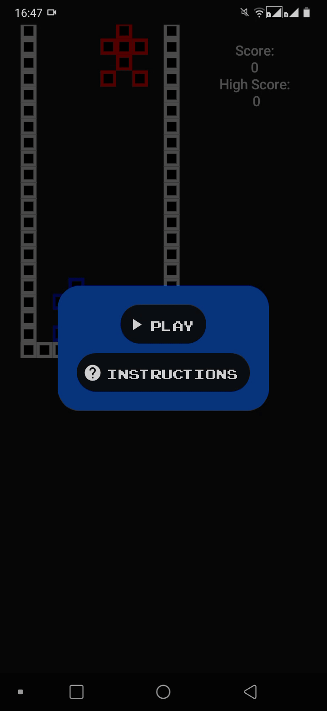

<p align="center">
  
</p>
<h1 align="center">
  Brick Car
</h1>

<p align="center">
  
</p>

Game created just for fun, using [Canvas](https://developer.android.com/jetpack/compose/graphics/draw/overview) in Jetpack Compose, inspired by the popular car racing game **"Brick Game"** .

The objective of the game is simply to dodge as many enemy cars as possible. The game controls are very simple:
- A tap on the screen changes the direction of your car;
- Holding the screen increases the speed of enemy cars and releasing it changes the direction of your car and normal speed is restored.

## Download APK

You can download the APK from [releases](https://github.com/jsericksk/Brick-Car/releases).

## License

```
MIT License

Copyright (c) 2023 Jesus Ericks

Permission is hereby granted, free of charge, to any person obtaining a copy
of this software and associated documentation files (the "Software"), to deal
in the Software without restriction, including without limitation the rights
to use, copy, modify, merge, publish, distribute, sublicense, and/or sell
copies of the Software, and to permit persons to whom the Software is
furnished to do so, subject to the following conditions:

The above copyright notice and this permission notice shall be included in all
copies or substantial portions of the Software.

THE SOFTWARE IS PROVIDED "AS IS", WITHOUT WARRANTY OF ANY KIND, EXPRESS OR
IMPLIED, INCLUDING BUT NOT LIMITED TO THE WARRANTIES OF MERCHANTABILITY,
FITNESS FOR A PARTICULAR PURPOSE AND NONINFRINGEMENT. IN NO EVENT SHALL THE
AUTHORS OR COPYRIGHT HOLDERS BE LIABLE FOR ANY CLAIM, DAMAGES OR OTHER
LIABILITY, WHETHER IN AN ACTION OF CONTRACT, TORT OR OTHERWISE, ARISING FROM,
OUT OF OR IN CONNECTION WITH THE SOFTWARE OR THE USE OR OTHER DEALINGS IN THE
SOFTWARE.
```
